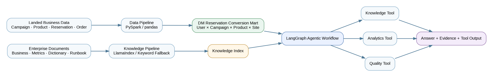
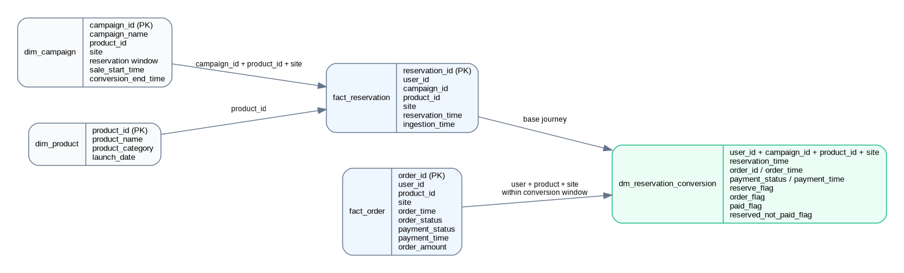
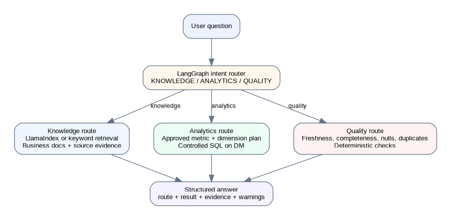

# Reservation Intelligence Data & AI Platform

> A compact, end-to-end Data & AI project for analysing the journey from **product reservation to order and final payment**.



## 1. Project at a glance

A global consumer-electronics company launches reservation campaigns for product models such as smartphones, tablets, robot vacuums, smart watches, and other smart-home devices across different country sites.

The business journey is deliberately simple:

```text
Campaign → Product Reservation → Order → Final Payment Status
```

This repository demonstrates how a Senior Data Engineer can combine:

- a reproducible **data pipeline**;
- a governed **DM reservation-conversion model**;
- an enterprise **knowledge retrieval pipeline**;
- a controlled **AI agentic workflow**;
- deterministic **data-quality diagnosis**;
- tests, evaluation, Docker packaging, and an AWS reference architecture.

The project uses only synthetic data and generalized business rules. It contains no confidential company information.

---

## 2. STAR project story

### Situation

Reservation, order, campaign, and product data are available in separate landed datasets. Business definitions are also scattered across requirements, metric definitions, table dictionaries, and operational runbooks.

Analysts repeatedly depend on data engineers to answer questions such as:

- What is the grain of the reservation conversion mart?
- How is a reservation attributed to a later order?
- What is the paid conversion rate by country site?
- Which users reserved a product but did not complete payment?
- Why is a dashboard partition incomplete or delayed?

The result is slow analysis, repeated SQL work, inconsistent metric interpretation, and avoidable operational support.

### Task

Build a small but complete platform that:

1. integrates campaign, product, reservation, and order data;
2. produces one governed **DM reservation conversion mart**;
3. supports business-document retrieval with source evidence;
4. routes user questions to the correct knowledge, analytics, or quality capability;
5. remains locally reproducible while showing how it could be deployed on AWS.

### Action

The project implements two coordinated pipelines and one controlled agent layer.

#### Structured-data pipeline

```text
Synthetic landed CSV files
        ↓
Schema parsing and timestamp standardisation
        ↓
Reservation deduplication
        ↓
Campaign and product enrichment
        ↓
Time-window attribution to the first valid order
        ↓
DM reservation conversion mart
        ↓
SQLite analytics database for the local demo
```

Key modelling decisions:

- reservations are captured at **product-model level**;
- colour, storage, and other SKU attributes are outside the MVP scope;
- final payment outcome is stored in the order table;
- an order is attributed using the same user, product, and site within the campaign conversion window;
- the first valid order is selected when more than one candidate exists;
- reserved-but-not-paid includes both no-order and payment-failed cases.

#### Knowledge pipeline

```text
Business requirement
Metric definitions
Table dictionary
Data-quality runbook
        ↓
Document loading and section-aware chunking
        ↓
Keyword retrieval in lightweight mode
or LlamaIndex vector retrieval in full mode
        ↓
Answer with supporting source excerpts
```

#### Agentic workflow

```text
User question
      ↓
LangGraph router
 ┌────┼───────────┐
 ↓    ↓           ↓
RAG  Analytics   Quality
 └────┼───────────┘
      ↓
Structured answer + evidence
```

LangChain exposes the domain tools, LangGraph manages routing and state, and LlamaIndex provides the optional semantic retrieval backend.

### Result

The repository provides a complete, runnable workflow that can:

- generate deterministic synthetic demo data;
- build the DM reservation conversion mart;
- answer business-definition questions with evidence;
- execute approved reservation metrics by governed dimensions;
- diagnose freshness, completeness, null, and duplicate issues;
- run automated tests and evaluation;
- start through CLI, FastAPI, Streamlit, or Docker Compose.

Evaluation scores are intentionally not hard-coded in this README. Run the supplied evaluator so that published results always reflect the current code and data.

---

## 3. Business scope

### Included

- product-model reservation campaigns;
- multiple country sites;
- campaign reservation and conversion windows;
- reservations, orders, and final payment outcomes;
- reservation-to-order and reservation-to-payment metrics;
- reserved-but-not-paid identification;
- business knowledge retrieval;
- governed analytics;
- deterministic data-quality diagnosis.

### Deliberately excluded from the MVP

- website SDK or event-tracking implementation;
- source-system CDC implementation;
- payment gateway integration;
- multiple payment attempts per order;
- colour/storage SKU-level reservations;
- unrestricted text-to-SQL;
- autonomous multi-agent collaboration;
- production cloud credentials and infrastructure provisioning.

The assumed enterprise boundary is:

```text
Operational systems
→ existing ingestion jobs
→ landed raw data
→ this project starts here
```

The GitHub demo uses local CSV files. The AWS section shows how those landed files map to Amazon S3.

---

## 4. Architecture


### Component responsibilities

| Component | Responsibility |
|---|---|
| `pandas` | lightweight, fast local transformation path |
| `PySpark` | optional scalable transformation path |
| `SQLite` | locally reproducible analytical store |
| `LlamaIndex` | optional document ingestion, embeddings, indexing, and semantic retrieval |
| `LangChain` | tool definitions and model-facing interfaces |
| `LangGraph` | state, intent routing, conditional workflow, and fallback execution |
| `FastAPI` | programmatic API |
| `Streamlit` | interactive demonstration UI |
| `pytest` | unit and integration testing |
| Docker Compose | reproducible API and UI startup |

The application works in a lightweight deterministic mode without an external LLM key. The full dependency set adds LangGraph, LangChain, LlamaIndex, local embeddings, and PySpark.

---

## 5. Data model



### Source tables

| Table | Grain | Main purpose |
|---|---|---|
| `dim_campaign` | one reservation campaign | reservation window, sale start, conversion end, product, and site |
| `dim_product` | one product model | product name, category, and launch date |
| `fact_reservation` | one reservation event | user, campaign, product, site, reservation time, ingestion time |
| `fact_order` | one order | user, product, site, order status, final payment status, amount, and times |

### Core DM

`dm_reservation_conversion`

**Grain**

```text
user_id × campaign_id × product_id × site
```

One row represents one user's reservation for one product model within one campaign and country site.

### Core fields

| Field | Meaning |
|---|---|
| `reservation_time` | time at which the user reserved the product model |
| `order_id` | first valid attributed order, when present |
| `order_time` | attributed order time |
| `payment_status` | final payment outcome stored on the order |
| `payment_time` | final payment outcome time |
| `reserve_flag` | valid reservation exists |
| `order_flag` | a valid order was attributed |
| `paid_flag` | final payment status is `SUCCESS` |
| `reserved_not_paid_flag` | valid reservation exists but successful payment does not |
| `partition_date` | reservation-date partition used by the demo |

### Attribution rule

A reservation is matched to an order when all conditions are true:

```text
same user_id
+ same product_id
+ same site
+ order_time >= campaign.sale_start_time
+ order_time <= campaign.conversion_end_time
```

When multiple candidate orders exist, the pipeline selects the first valid order by `order_time`.

### Why payment is not a separate table

Real payment platforms often require a separate payment-attempt fact because one order may have multiple failed and successful attempts. This MVP stores only the final payment result on `fact_order` to keep the project focused on Data & AI integration rather than payment-event modelling.

---

## 6. Metrics

| Metric | Definition |
|---|---|
| `reservation_users` | distinct users with valid reservations |
| `order_users` | distinct reserved users with an attributed order |
| `paid_users` | distinct reserved users with successful final payment |
| `reservation_to_order_rate` | order users ÷ reservation users |
| `reservation_to_payment_rate` | paid users ÷ reservation users |
| `reserved_not_paid_users` | distinct reserved users without successful payment |

Approved analytical dimensions in the MVP are:

```text
site
campaign_name
product_name
product_category
```

The analytics layer does not execute arbitrary LLM-generated SQL. It converts supported user questions into an allow-listed metric-and-dimension query plan and then builds controlled SQL.

---

## 7. AI agent design



The MVP uses **one controlled agentic workflow with three domain routes**, not a multi-agent team.

| Route | Typical question | Execution path |
|---|---|---|
| `KNOWLEDGE` | What does reserved-not-paid mean? | retrieve relevant documents and return source excerpts |
| `ANALYTICS` | Show paid conversion rate by site | parse an approved query plan and execute controlled SQL |
| `QUALITY` | Why is the SG dashboard incomplete? | execute deterministic data-quality checks |

### Why this is an AI agent rather than only RAG

The workflow performs more than retrieve-and-generate:

```text
understand intent
→ choose a domain route
→ invoke the correct tool
→ inspect structured evidence
→ return a route-aware response
```

It includes state, tool selection, conditional routing, structured output, evidence, and deterministic fallback behaviour.

### Why AutoGen is not included

Adding AutoGen would introduce a second orchestration framework with overlapping responsibilities. LangGraph is sufficient for explicit state and routing in this scope. A supervisor-and-specialist multi-agent extension can be added later without changing the core data model.

---

## 8. Repository structure

```text
reservation-intelligence-platform/
├── app/
│   ├── analytics.py          # allow-listed metrics and controlled SQL
│   ├── api.py                # FastAPI endpoints
│   ├── cli.py                # command-line question interface
│   ├── config.py             # environment-based configuration
│   ├── graph.py              # LangGraph workflow and fallback path
│   ├── quality.py            # deterministic DQ checks
│   ├── retrieval.py          # keyword and LlamaIndex backends
│   ├── router.py             # intent classification
│   ├── schemas.py            # typed request/response state
│   └── tools.py              # LangChain tool wrappers
├── pipelines/
│   ├── generate_sample_data.py
│   └── build_reservation_mart.py
├── data/
│   ├── raw/                  # synthetic landed source files
│   ├── warehouse/            # generated DM CSV and local SQLite DB
│   ├── documents/            # business and technical knowledge base
│   └── index/                # generated retrieval index
├── docs/
│   ├── architecture.png
│   ├── data_model.png
│   ├── agent_workflow.png
│   └── architecture_decisions.md
├── evaluation/
│   ├── questions.json
│   └── evaluate.py
├── infrastructure/
│   └── aws-reference/
├── tests/
├── .dockerignore
├── .env.example
├── .gitignore
├── Dockerfile
├── docker-compose.yml
├── Makefile
├── pyproject.toml
├── requirements-lite.txt
├── requirements.txt
├── streamlit_app.py
└── README.md
```

Generated Python caches, test caches, local virtual environments, IDE settings, compiled files, model caches, logs, secrets, and local warehouse databases are excluded by `.gitignore`.

---

## 9. Prerequisites

### Lightweight mode

- Python 3.11 or later
- `pip`
- GNU Make is convenient but optional

### Full mode

In addition to the lightweight requirements:

- Java compatible with the installed PySpark version;
- enough local memory for PySpark and the embedding model;
- internet access during first model download when using the LlamaIndex Hugging Face backend.

### Docker mode

- Docker Engine or Docker Desktop
- Docker Compose v2

---

## 10. Setup and run

### Option A — recommended lightweight local setup

Clone the repository:

```bash
git clone <your-github-repository-url>
cd reservation-intelligence-platform
```

Create and activate a virtual environment:

```bash
python -m venv .venv
source .venv/bin/activate
```

Windows PowerShell:

```powershell
python -m venv .venv
.venv\Scripts\Activate.ps1
```

Install lightweight dependencies:

```bash
python -m pip install --upgrade pip
pip install -r requirements-lite.txt
```

Generate the sample source data and build the mart:

```bash
make bootstrap
```

Equivalent commands without Make:

```bash
python pipelines/generate_sample_data.py
python pipelines/build_reservation_mart.py
```

Run tests:

```bash
make test
```

Ask a CLI question:

```bash
python -m app.cli "Show paid conversion rate by site"
```

### Option B — full AI and PySpark mode

Install the full dependencies:

```bash
pip install -r requirements.txt
```

Enable semantic retrieval and the Spark pipeline:

```bash
export RETRIEVAL_BACKEND=llamaindex
export PIPELINE_ENGINE=spark
make bootstrap
```

The first semantic-retrieval run may download the configured embedding model.

### Option C — Docker Compose

Build and start both API and UI:

```bash
docker compose up --build
```

Open:

- FastAPI documentation: `http://localhost:8000/docs`
- Streamlit UI: `http://localhost:8501`

Stop the services:

```bash
docker compose down
```

### Option D — run services separately

Start the API:

```bash
uvicorn app.api:app --reload --host 0.0.0.0 --port 8000
```

Start the UI in another terminal:

```bash
streamlit run streamlit_app.py
```

---

## 11. Configuration

Copy the example file when local overrides are needed:

```bash
cp .env.example .env
```

Important settings:

| Variable | Typical value | Purpose |
|---|---|---|
| `PIPELINE_ENGINE` | `pandas` or `spark` | selects transformation engine |
| `RETRIEVAL_BACKEND` | `keyword` or `llamaindex` | selects retrieval implementation |
| `AI_MODE` | `mock` or configured provider mode | controls final model integration |
| `OPENAI_API_KEY` | secret value | optional external model credential |

Never commit `.env` or real API keys. The included `.gitignore` excludes them.

---

## 12. Demo walkthrough

### Step 1 — generate landed source data

```bash
python pipelines/generate_sample_data.py
```

This creates four synthetic source files under `data/raw/`:

```text
dim_campaign.csv
dim_product.csv
fact_reservation.csv
fact_order.csv
```

The random generator is seeded, so the output is reproducible.

### Step 2 — build the DM

```bash
python pipelines/build_reservation_mart.py
```

Outputs:

```text
data/warehouse/dm_reservation_conversion.csv
data/warehouse/reservation.db
```

The SQLite file is a generated local runtime artifact and is ignored by Git.

### Step 3 — ask knowledge questions

```bash
python -m app.cli "What is the grain of the reservation conversion mart?"
python -m app.cli "How is a reservation matched to an order?"
python -m app.cli "What does reserved-not-paid mean?"
```

Expected route: `KNOWLEDGE`.

### Step 4 — ask analytics questions

```bash
python -m app.cli "Show paid conversion rate by site"
python -m app.cli "Which campaign has the lowest paid conversion rate?"
python -m app.cli "How many users reserved but did not pay by product category?"
```

Expected route: `ANALYTICS`.

### Step 5 — diagnose a quality issue

```bash
python -m app.cli "Why is the Singapore reservation dashboard incomplete on 2026-07-31?"
```

The sample generator deliberately creates an incomplete SG partition for that date. The quality route compares the row count with a historical baseline and also checks freshness, nulls, and duplicate reservation IDs.

---

## 13. Testing

Run the full test suite:

```bash
pytest -q
```

The tests cover:

- source-to-DM pipeline construction;
- supported analytics metrics;
- quality-check behaviour;
- document retrieval;
- question routing.

Run one test module:

```bash
pytest -q tests/test_pipeline.py
```

Run with coverage after installing a coverage plugin:

```bash
pytest --cov=app --cov=pipelines --cov-report=term-missing
```

---

## 14. Evaluation

Run:

```bash
python evaluation/evaluate.py
```

The evaluator checks:

- routing accuracy;
- expected-document retrieval hit rate;
- deterministic analytics answer accuracy.

The evaluation dataset is stored in `evaluation/questions.json`, making expected routes and evidence inspectable rather than hidden in prompts.

Do not publish invented scores. Copy the output generated by the current commit into a release note or portfolio page when needed.

---

## 15. Data-quality design

The quality route executes deterministic checks rather than asking an LLM to calculate data quality.

| Check | Purpose |
|---|---|
| partition completeness | compare actual rows with a historical baseline |
| duplicate rate | detect repeated `reservation_id` values |
| null rate | validate key business columns |
| freshness | measure ingestion delay from source event time |

The agent explains the structured result and recommended action, but the actual pass/fail decision remains deterministic and testable.

---

## 16. Security and governance controls

The MVP demonstrates several practical controls:

- allow-listed dimensions and metrics;
- controlled SQL generation rather than arbitrary text-to-SQL;
- read-only analytical execution;
- source evidence for knowledge answers;
- environment-based secret handling;
- deterministic quality rules;
- synthetic public-safe data;
- explicit project scope and architecture decisions.

Potential production additions include row-level security, metric-version metadata, query auditing, PII masking, model tracing, prompt-injection filtering, and human approval for higher-risk actions.

---

## 17. AWS reference architecture

The repository is locally reproducible and cloud-portable. The AWS reference maps the same logical components as follows:

| Local demo | AWS reference |
|---|---|
| CSV landed files | Amazon S3 raw zone |
| pandas / local PySpark | AWS Glue Spark jobs |
| DM CSV | partitioned Parquet on S3 |
| SQLite | Amazon Athena with Glue Data Catalog |
| local document directory | Amazon S3 knowledge-document prefix |
| local vector index | OpenSearch Serverless or PostgreSQL with pgvector |
| model adapter | Amazon Bedrock |
| FastAPI and Streamlit containers | Amazon ECS on Fargate |
| local logs | Amazon CloudWatch |
| local environment variables | AWS Secrets Manager / Systems Manager Parameter Store |

See [`infrastructure/aws-reference/README.md`](infrastructure/aws-reference/README.md) for the reference deployment boundary.

Important distinction:

> The GitHub implementation does not claim that its sample data is already stored in a real AWS account. AWS is a reference deployment target; the default demo is local and reproducible.

---

## 18. Engineering decisions and trade-offs

### Product model instead of SKU

Reservation is modelled at product level. Users select colour, capacity, and other SKU attributes during ordering. This keeps the reservation grain stable and the demo easy to understand.

### Final payment state in the order table

A separate payment-attempt fact is unnecessary for the current analytical questions. It can be introduced later when retry behaviour or payment-channel analysis becomes relevant.

### One agent with three tools

The three tasks share one domain and one analytical mart. A supervisor plus multiple specialist agents would add token cost and debugging complexity without improving the MVP result.

### Controlled analytics instead of unrestricted text-to-SQL

The application supports approved metrics and dimensions. This makes results deterministic, secure, testable, and easier to explain in an enterprise interview.

### Lightweight and full modes

The keyword/pandas mode reduces installation time and supports CI. The LlamaIndex/PySpark mode demonstrates the intended production-style capabilities without making them mandatory for every reviewer.

---

## 19. Extending the project

A sensible progression is:

### Version 2

- PDF, DOCX, XLSX, and PPTX ingestion;
- hybrid dense-plus-keyword retrieval;
- reranking and citation validation;
- richer date and filter parsing;
- FastAPI-to-Streamlit API integration;
- persisted vector store;
- LangSmith or OpenTelemetry tracing.

### Version 3

- S3 and Glue deployment;
- Athena query adapter;
- Bedrock model adapter;
- ECS deployment;
- event-driven ingestion;
- human approval for selected actions;
- supervisor-based specialist agents for cross-domain investigation.

### Reusable lifecycle scenarios

The same milestone-based architecture can later support:

```text
Merchant registration → KYC → store binding → first settlement
Loan application → review → approval → disbursement
Membership registration → activation → first transaction
```

The current repository intentionally keeps only `Reservation → Order → Payment` as the main demo.

---

## 20. Interview talking points

A concise explanation:

> I built a Reservation Intelligence Data & AI Platform around a simple consumer-electronics journey from reservation to order and final payment. A pandas or PySpark pipeline produces a governed User × Campaign × Product × Site DM. A LangGraph workflow then routes questions between LlamaIndex-based business knowledge retrieval, allow-listed analytics, and deterministic data-quality checks. The repository is fully reproducible locally and includes tests, evaluation, Docker packaging, and an AWS reference architecture.

Be prepared to explain:

1. why the DM grain is User × Campaign × Product × Site;
2. why reservation-to-order attribution needs a campaign conversion window;
3. why payment is folded into order for the MVP;
4. why the project uses one agent with multiple tools;
5. how LangChain, LangGraph, and LlamaIndex responsibilities differ;
6. how arbitrary SQL execution is prevented;
7. how RAG and routing are evaluated;
8. how late, duplicate, or incomplete data is diagnosed;
9. how the local architecture maps to AWS;
10. which parts are implemented versus documented as future work.

---

## 21. Resume-ready description

**Reservation Intelligence Data & AI Platform**

- Built a cloud-portable Data & AI platform using **PySpark, LangChain, LangGraph, and LlamaIndex** to support reservation-domain knowledge retrieval, governed conversion analytics, and data-quality diagnosis.
- Developed a pipeline that integrated campaign, product, reservation, and order data into a **User × Campaign × Product × Site** DM using deduplication, campaign-window attribution, and reserved-not-paid tagging.
- Implemented a controlled agentic workflow that routes questions between document retrieval, approved metric queries, and deterministic freshness, completeness, null, and duplicate checks.
- Added FastAPI and Streamlit interfaces, automated tests, evaluation datasets, Docker packaging, and an AWS reference deployment design.

---

## 22. Useful commands

```bash
make bootstrap   # generate data and build the DM
make test        # run pytest
make eval        # run evaluation
make api         # start FastAPI
make ui          # start Streamlit
make clean       # remove generated local data outputs
```

Before committing to GitHub, verify the repository is clean:

```bash
find . -type d -name __pycache__ -prune -exec rm -rf {} +
rm -rf .pytest_cache .mypy_cache .ruff_cache
find . -type f \( -name '*.pyc' -o -name '*.pyo' \) -delete
git status
```

These files are already covered by `.gitignore`, but cleaning them before the first commit keeps the uploaded archive tidy.

---

## 23. Disclaimer

This project is a portfolio and learning implementation. All data is synthetic, company names are generalized, and architecture choices are simplified for clarity and reproducibility. No production SLA, security certification, or live AWS deployment is claimed.
